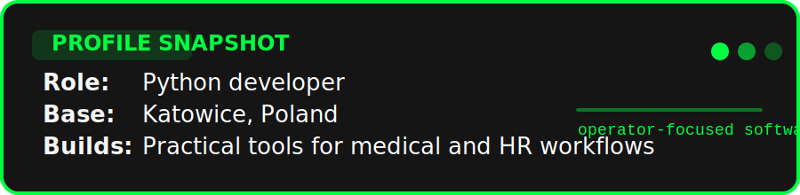
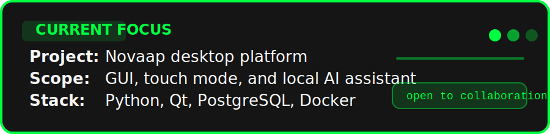

# 

  
  
  

Python developer based in Katowice, Poland.
I build practical tools for medical and HR workflows, and I like projects that connect software with real operational needs.

<picture>
  <source media="(prefers-color-scheme: dark)" srcset="https://raw.githubusercontent.com/Mateusz-CristalCodeai/githube-readme/output/snake-dark.svg" />
  <source media="(prefers-color-scheme: light)" srcset="https://raw.githubusercontent.com/Mateusz-CristalCodeai/githube-readme/output/snake-light.svg" />
  
</picture>

## About

- Role: Python developer
- Location: Katowice, Poland
- Interests: biomed, finance, applied software
- Current focus: building an app for senior care facilities to manage HR resources and analyze medical data

## What I do

- Build projects that solve real problems
- Experiment with new technologies and document what actually works
- Work not only at a desk, but also directly with people and domain teams

## Featured project

| Project | What it does | Stack |
| --- | --- | --- |
| Novaap | Desktop app for managing medical processes with a GUI, touch mode, and a local Bielik-based chat assistant. | Python, Qt Widgets/QML, PostgreSQL, Docker |

## Tech stack

<strong>Systems & Distros</strong> 
  

<strong>Languages</strong> 
  

<strong>Frameworks</strong> 
  

<strong>Tools</strong> 

 

## Snapshot

  
    
  

A stable snapshot of what I build and what I am focused on right now.

---

If you want to collaborate, feel free to reach out.
