# 

Python engineer building healthcare, AI, and operational tools in Katowice, Poland.
<picture>
  <source media="(prefers-color-scheme: dark)" srcset="https://raw.githubusercontent.com/Mateusz-CristalCodeai/githube-readme/output/snake-dark.svg" />
  <source media="(prefers-color-scheme: light)" srcset="https://raw.githubusercontent.com/Mateusz-CristalCodeai/githube-readme/output/snake-light.svg" />
  
</picture>

## About

Role: Python engineer.
Location: Katowice, Poland.
Focus: Healthcare software, local AI, automation, data-driven tools, and VPS operations.
Currently: Building products for medical workflows, senior-friendly mobile apps, and practical internal systems.

  </pre>

## What I do

- Build software for real operational workflows
- Turn manual tasks into usable tools, automation, and cleaner data flows
- Work across desktop, web, and mobile when the product needs it
- Manage VPS servers and take care of server hardening, deployment, and operational security
- Stay close to users and translate real-world problems into working systems

## Featured projects

| Project | Description | Stack |
| --- | --- | --- |
| Novaaap | Desktop application for medical workflows with GUI, touch mode, OCR features, PostgreSQL, and local Bielik chat integration. | Python, PySide6/Qt, QML, PostgreSQL, Docker, FastAPI |
| Telefon Senior | Mobile senior-mode app with caregiver and admin flows, simplified UI, secure PIN logic, and Android-first deployment path. | React Native, Expo, TypeScript |
| gie-da | Backtesting and portfolio monitoring sandbox for ranking strategies, market analysis, and benchmark reporting. | Python, pandas, yfinance, matplotlib, openpyxl |
| [naszdobrostan.org](https://naszdobrostan.org) | Foundation website focused on wellbeing, intergenerational communities, education, and support for seniors, built as a modern content-driven web experience. | React, TypeScript, Vite, Tailwind |
| [Gaminco](https://github.com/Mateusz-CristalCodeai/strona_gaminco) | Automation and internal tooling for a consulting company: telemetry backend, newsletter/data flows, deployment scripts, VPS operations, and repeatable workflows for quality, security, and delivery. | React, Vite, Node.js, PostgreSQL, PowerShell |

## Tech stack

<strong>Systems & Platforms</strong> 
  

<strong>Languages</strong> 
  
<strong>Frameworks</strong> 
  

<strong>Tools</strong> 

 

## Contact

  
  

---

Open to collaboration on healthcare software, AI automation, and data-driven products.
