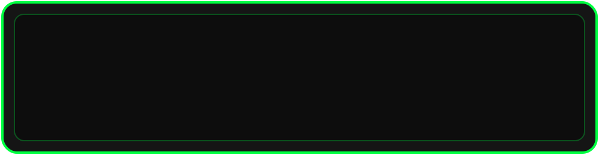
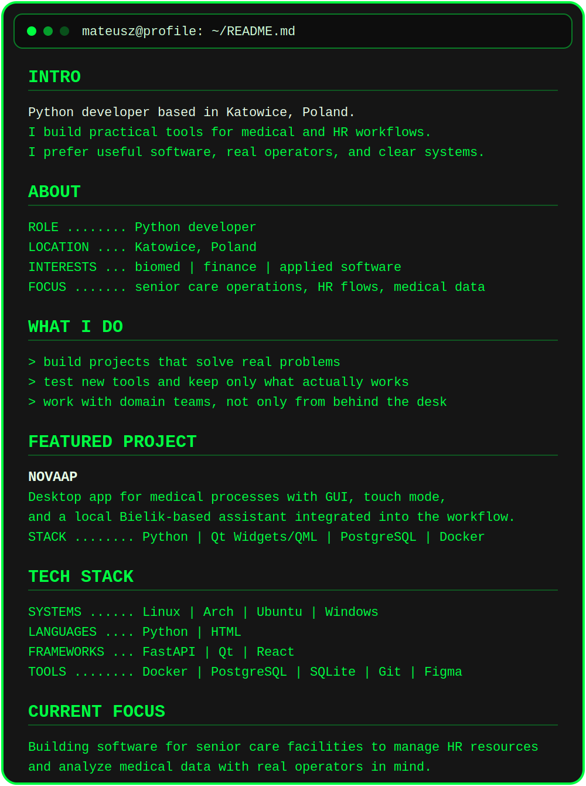

# 

  
  
  

<picture>
  <source media="(prefers-color-scheme: dark)" srcset="assets/snake-frame-dark.svg" />
  <source media="(prefers-color-scheme: light)" srcset="assets/snake-frame-light.svg" />
  
</picture>

  

