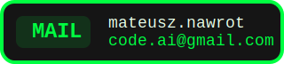
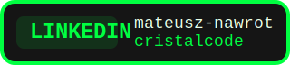
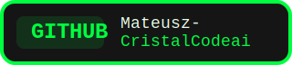

# 

  
  
  

<picture>
  <source media="(prefers-color-scheme: dark)" srcset="https://raw.githubusercontent.com/Mateusz-CristalCodeai/githube-readme/output/snake-dark.svg" />
  <source media="(prefers-color-scheme: light)" srcset="https://raw.githubusercontent.com/Mateusz-CristalCodeai/githube-readme/output/snake-light.svg" />
  
</picture>

  

